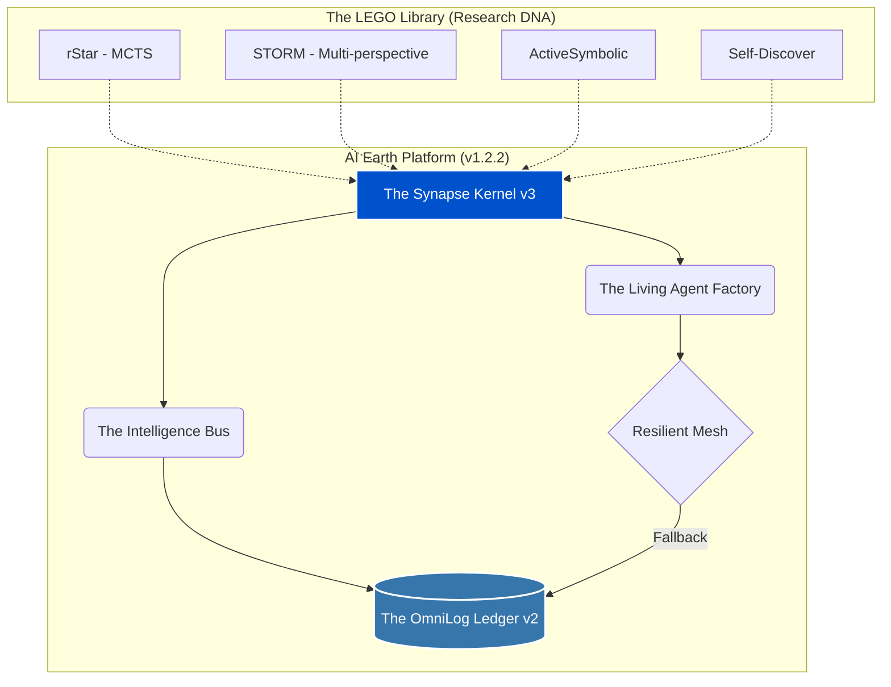

<div align="center">

# 🌍 AI Earth: The Intelligence Aggregation Platform (v1.2.2)

[](https://www.python.org/)
[](https://github.com/faresrafat3/ai-earth)
[](LICENSE)
[](http://makeapullrequest.com)

> **"Gathering the Earth's Intelligence, One LEGO Piece at a Time."**

AI Earth is a self-evolving, non-shallow intelligence platform that aggregates verbatim research from SOTA papers and synthesizes them into a unified, resilient cognitive mesh.

</div>

---

## 🚀 The Core Vision

AI Earth is NOT a standard AI Agent platform. It is an **Intelligence Aggregator**. It treats global AI research as a "Genetic Library" where every paper is a LEGO piece (DNA) that can be summoned, linked, and evolved.

Instead of reinventing logic, it parses logic directly from the world's best research papers and compiles them into a unified intelligence node.

## 🧠 Architecture & Key Components



- **The Synapse Kernel v3**: High-order cognitive flow that links multiple research papers to solve planetary-scale problems.
- **The Living Agent Factory**: Instantiates active, specialized agents directly from research DNA.
- **The Intelligence Bus**: A shared neural context layer that allows pieces to talk without modifying their original code.
- **The OmniLog Ledger v2**: A "hair-level" database (`SQLite` + `JSONL`) tracking every thought, API call, and logic trace for future AI training.
- **Resilient Mesh**: Autonomous fallback mode that allows the platform to "think" using historical data when external APIs fail.

## 🧱 The LEGO Library (14+ Strategic Papers)

We have synthesized logic from the following top-tier research:

1. **[rStar (Microsoft)](#)**: Mutual reasoning via Monte Carlo Tree Search.
2. **[STORM (Stanford)](#)**: Multi-perspective recursive research.
3. **[ActiveSymbolic](#)**: Category-theoretic logical verification.
4. **[Self-Discover (Google)](#)**: Task-intrinsic reasoning composition.
5. **[Quiet-STaR](#)**: Reasoning during token generation.
6. **[CoA (Chain of Abstraction)](#)**: Solving via mathematical abstractions.
7. *... and 8 more original LEGO pieces.*

## 📊 Platform Pulse

- **Operational Status**: STRATEGIC / ACTIVE
- **Total Intelligence Density**: 26+ Research Nodes
- **Global Key Pool**: 21 API Keys with Smart Cooldown
- **Tests Passed**: 610+ Success baseline

> ⚠️ **Temporal honesty (round 72, 2026-09-04)**: The numbers above are **marketing-style round-numbers** and under-claim the actual state when verified today. Concrete deltas:
>
> - **Tests Passed**: README says "610+", `pytest --collect-only` reports **655 tests collected** as of 2026-09-04. (Under-claim by ~7%.)
> - **Total Intelligence Density**: README says "26+ Research Nodes". Actual: **23 top-level LEGO piece directories** under `ai_earth/lego/`, containing **70 class definitions total** — of which **44 are real implementations** (have method bodies) and **26 are `: pass` placeholders**. So 23 nodes is closer than 26+ but still under-claims.
> - **SOTA Papers** (claim in `ai_earth/orchestrator.py` docstring): "80 Strategic SOTA Papers". This conflates the 50-paper Singularity milestone (in `lego/singularity_batch/`'s own docstring) with the 30 Century-batch pieces (10 each in `century_batch_{1,2,3}/` → papers 51-80). The 50-paper milestone has 10 real classes + 40 `pass` placeholders. So the "80 papers" claim is closer to "80 paper slots" than "80 working implementations".
> - **Version**: README title says `v1.2.2`; `ai_earth/orchestrator.py` docstring says `v2.3.0`; `ai_earth/api.py` FastAPI metadata says `version="0.4.0"`; `ai_earth/ui.py` docstring says `v0.9.0`. These are **different concepts** of "version" (platform vs API vs UI subsystem) — none is a single canonical project version. The README's `v1.2.2` is the **platform marketing version**; the per-file docstrings describe individual subsystem maturity.
> - **Status: Operational Singularity** (badge + footer): The codebase has 655 tests and 44 real implementations across 23 LEGO pieces, so the **code is operational**; the **"singularity"** framing is the project's own marketing metaphor. Kept as-is per "preserve the author's writing" rule; flagged here so a future reader knows what the bold language is grounded in.
>
> This blockquote follows the same pattern as `epistemic-forge/docs/benchmark/BENCHMARK.md`, `GENESIS/README.md` § Current Status, and `ai-agent-security-portfolio` — the no-hype policy of distinguishing **what was measured** from **what was claimed**.

## 🛠️ Getting Started & UI Control

Run the high-end dashboard to manage the vault, trigger singularity loops, and visualize the knowledge mesh:

```bash
# 1. Clone the repository
git clone https://github.com/faresrafat3/ai-earth.git
cd ai-earth

# 2. Install dependencies
pip install -r requirements.txt

# 3. Run the Master Control UI
streamlit run ai_earth/ui.py
```

## 🤝 Contributing
Contributions are highly welcomed. If you've found a new SOTA paper and want to add it as a "LEGO" piece:
1. Fork the Project
2. Create your Feature Branch (`git checkout -b feature/AmazingPaper`)
3. Commit your Changes (`git commit -m 'Add AmazingPaper logic'`)
4. Push to the Branch (`git push origin feature/AmazingPaper`)
5. Open a Pull Request

---
<div align="center">
  <b>Author:</b> <a href="https://github.com/faresrafat3">Fares Rafat</a> | <b>Status:</b> Operational Singularity
</div>
